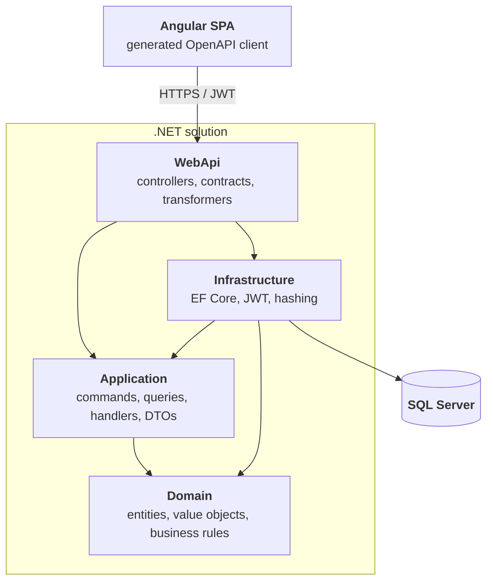

# Ticket Booking Platform

A demo event ticketing platform built as a portfolio project to showcase **.NET backend
engineering with Clean Architecture**, exposing a versioned **REST API** consumed by an
**Angular SPA** through a generated OpenAPI client.

---

## Tech stack

### Backend

| Area | Technology |
|---|---|
| Framework | .NET 9 |
| Web | ASP.NET Core Web API, REST endpoints |
| Persistence | Entity Framework Core 9, code-first migrations |
| Database | SQL Server |
| Architecture | Clean Architecture (Domain / Application / Infrastructure / WebApi) |
| Application layer | CQRS-style commands & queries with hand-written handlers (no MediatR) |
| AuthN / AuthZ | JWT Bearer tokens, role-based policies (`User`, `Organizer`, `Admin`) |
| Password hashing | ASP.NET Core Identity `PasswordHasher` |
| API versioning | URL segment (`/api/v{version}/...`), v1 & v2 documents |
| API docs | Built-in OpenAPI + Scalar UI |
| Error handling | `IExceptionHandler` + RFC 7807 `ProblemDetails` |
| Testing | xUnit, FluentAssertions, NSubstitute, Entity Framework Core InMemory |

### Frontend

| Area | Technology |
|---|---|
| Framework | Angular 22 |
| UI | Angular Material |
| Language / styling | TypeScript, SCSS |
| API client | Generated from OpenAPI via `openapi-generator-cli` |
| Cross-cutting | HTTP interceptors (auth token, timeout), route guards (`authGuard`, `roleGuard`) |

---

## Architecture



Dependency rule: `Domain` has no project references. `Application` depends only on `Domain` and
defines its own abstractions (`IApplicationDbContext`, `IJwtTokenGenerator`, `IPasswordHasher`,
`ICurrentUserService`), which `Infrastructure` and `WebApi` implement — so the flow of control
points inward while the flow of dependencies is inverted at the boundaries.

```
src/
├── Domain/          Events, Locations, Orders, Tickets, Users + Money / TicketCode value objects
├── Application/     Feature-per-folder CQRS handlers, DTOs, paging helpers, exceptions
├── Infrastructure/  ApplicationDbContext, configurations, migrations, seeding, JWT, hashing
└── WebApi/          V1 & V2 controllers, request contracts, OpenAPI transformers, Program.cs
tests/
├── Domain.Tests/        Aggregate invariants & business rules
└── Application.Tests/   Handler behaviour against EF Core InMemory + NSubstitute doubles
frontend/
└── ticket-booking-web/  Angular SPA
```

---

## Key technical decisions

- **Clean Architecture over a "services + repositories" CRUD stack.** Business rules live in the
  domain aggregates (`Event.Publish()`, `Order.Pay()`, `TicketCategory` capacity checks), not in
  controllers or handlers.
- **No MediatR.** Handlers are plain classes registered explicitly in `AddApplication()`. It keeps
  the call stack navigable (F12 goes straight to the handler), removes a licensing/runtime
  dependency, and shows the pattern is understood rather than imported.
- **No AutoMapper.** Mapping is explicit (e.g. `OrderMapper`), so projections are compile-time
  checked and there is no reflection-based magic between layers.
- **Domain exceptions mapped centrally.** `BusinessRuleException`, `NotFoundException` and
  `ConflictException` are translated into `ProblemDetails` by a single `GlobalExceptionHandler`,
  so controllers contain no try/catch noise.
- **URL-segment API versioning from day one.** v2 exists to demonstrate coexisting contracts
  (`/api/v1/Events` vs `/api/v2/Events`) with separate OpenAPI documents per version.
- **OpenAPI-driven frontend.** Controllers use explicit action and route names so generated client
  methods stay clean (`getEvents()` rather than `apiV1EventsGet()`); the TypeScript client is
  generated, never hand-written.
- **Secrets stay out of the repo.** Connection string defaults to LocalDB; JWT signing key and the
  seeded admin credentials are read from user secrets / environment variables and the app fails
  fast at startup if they are missing.

---

## Getting started

**Prerequisites:** .NET SDK 9.0+, SQL Server LocalDB (or any SQL Server instance), Node.js 24 + Angular CLI 22 for the frontend.

```powershell
git clone https://github.com/muszkab/TicketBookingPlatform.git
cd TicketBookingPlatform
```

Configure the required secrets:

```powershell
dotnet user-secrets --project src/WebApi set "JwtSettings:SigningKey" "<at-least-32-character-random-key>"
dotnet user-secrets --project src/WebApi set "Seed:Admin:Email" "admin@example.com"
dotnet user-secrets --project src/WebApi set "Seed:Admin:Password" "<strong-password>"
```

Run the API (migrations are applied and reference data is seeded automatically on startup):

```powershell
dotnet run --project src/WebApi
```

| Endpoint | URL |
|---|---|
| API | `https://localhost:5001/api/v1/...` |
| Scalar API reference | `https://localhost:5001/scalar` |
| OpenAPI documents | `/openapi/v1.json`, `/openapi/v2.json` |

Run the tests:

```powershell
dotnet test
```

Run the frontend:

```powershell
cd frontend/ticket-booking-web
npm install
npm start   # https://localhost:4200
```

---

## Feature overview

Event & location management (admin/organizer), event publishing and cancellation, ticket categories
with capacity limits, catalogue browsing with paging and filtering, JWT login, cart and checkout,
order payment/cancellation, and issued tickets with QR codes.

## Roadmap

- [ ] Upgrade to .NET 10 (LTS)
- [x] Docker Compose (SQL Server + API + SPA)
- [ ] HTTPS via a reverse proxy service (Traefik/Caddy) terminating TLS in front of the SPA and API
- [ ] FluentValidation for command/query input validation
- [ ] Integration tests with `WebApplicationFactory` + Testcontainers
- [x] CI/CD pipeline (build, test, OpenAPI drift check, container image publish)
- [ ] Cloud-native readiness (health checks, OpenTelemetry, externalised configuration)
- [ ] Deployment to Azure (Container Apps + Azure SQL + Static Web Apps, secrets in Key Vault)
