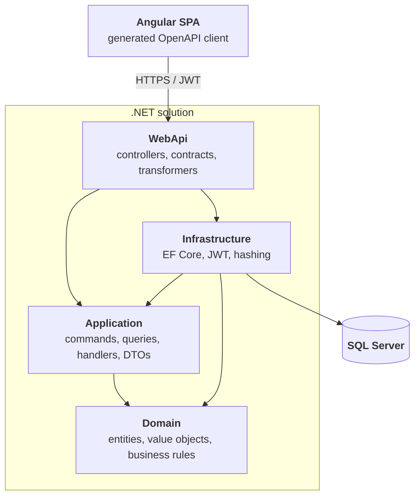

# Ticket Booking Platform

A demo event ticketing platform built as a portfolio project to showcase **.NET backend
engineering with Clean Architecture**, exposing a versioned **REST API** consumed by an
**Angular SPA** through a generated OpenAPI client.

---

## Tech stack

### Backend

| Area | Technology |
|---|---|
| Framework | .NET 9 |
| Web | ASP.NET Core Web API, REST endpoints |
| Persistence | Entity Framework Core 9, code-first migrations |
| Database | SQL Server |
| Architecture | Clean Architecture (Domain / Application / Infrastructure / WebApi) |
| Application layer | CQRS-style commands & queries with hand-written handlers (no MediatR) |
| AuthN / AuthZ | JWT Bearer tokens, role-based policies (`User`, `Organizer`, `Admin`) |
| Password hashing | ASP.NET Core Identity `PasswordHasher` |
| API versioning | URL segment (`/api/v{version}/...`), v1 & v2 documents |
| API docs | Built-in OpenAPI + Scalar UI |
| Error handling | `IExceptionHandler` + RFC 7807 `ProblemDetails` |
| Health checks | ASP.NET Core health checks (`/health/live`, `/health/ready`) |
| Observability | OpenTelemetry traces, metrics and logs exported over OTLP |
| Configuration | Layered `appsettings.json` → user secrets → environment variables |
| Testing | xUnit, FluentAssertions, NSubstitute, Entity Framework Core InMemory |

### Frontend

| Area | Technology |
|---|---|
| Framework | Angular 22 |
| UI | Angular Material |
| Language / styling | TypeScript, SCSS |
| API client | Generated from OpenAPI via `openapi-generator-cli` |
| Cross-cutting | HTTP interceptors (auth token, timeout), route guards (`authGuard`, `roleGuard`) |

---

## Architecture



Dependency rule: `Domain` has no project references. `Application` depends only on `Domain` and
defines its own abstractions (`IApplicationDbContext`, `IJwtTokenGenerator`, `IPasswordHasher`,
`ICurrentUserService`), which `Infrastructure` and `WebApi` implement — so the flow of control
points inward while the flow of dependencies is inverted at the boundaries.

```
src/
├── Domain/          Events, Locations, Orders, Tickets, Users + Money / TicketCode value objects
├── Application/     Feature-per-folder CQRS handlers, DTOs, paging helpers, exceptions
├── Infrastructure/  ApplicationDbContext, configurations, migrations, seeding, JWT, hashing
├── Migrator/        Standalone migrator container (applies migrations + seeds before the API starts)
└── WebApi/          V1 & V2 controllers, request contracts, OpenAPI transformers, Program.cs
tests/
├── Domain.Tests/        Aggregate invariants & business rules
└── Application.Tests/   Handler behaviour against EF Core InMemory + NSubstitute doubles
frontend/
└── ticket-booking-web/  Angular SPA
```

---

## Key technical decisions

- **Clean Architecture over a "services + repositories" CRUD stack.** Business rules live in the
  domain aggregates (`Event.Publish()`, `Order.Pay()`, `TicketCategory` capacity checks), not in
  controllers or handlers.
- **No MediatR.** Handlers are plain classes registered explicitly in `AddApplication()`. It keeps
  the call stack navigable (F12 goes straight to the handler), removes a licensing/runtime
  dependency, and shows the pattern is understood rather than imported.
- **No AutoMapper.** Mapping is explicit (e.g. `OrderMapper`), so projections are compile-time
  checked and there is no reflection-based magic between layers.
- **Domain exceptions mapped centrally.** `BusinessRuleException`, `NotFoundException` and
  `ConflictException` are translated into `ProblemDetails` by a single `GlobalExceptionHandler`,
  so controllers contain no try/catch noise.
- **URL-segment API versioning from day one.** v2 exists to demonstrate coexisting contracts
  (`/api/v1/Events` vs `/api/v2/Events`) with separate OpenAPI documents per version.
- **OpenAPI-driven frontend.** Controllers use explicit action and route names so generated client
  methods stay clean (`getEvents()` rather than `apiV1EventsGet()`); the TypeScript client is
  generated, never hand-written.
- **Secrets stay out of the repo.** Connection string defaults to LocalDB; JWT signing key and the
  seeded admin credentials are read from user secrets / environment variables and the app fails
  fast at startup if they are missing.
- **Migrations are a separate deployment step.** A dedicated `migrator` container (see
  `src/Migrator`) applies migrations and seeds reference data before the API starts, so the API can
  run with multiple replicas without racing on the schema. In-process migration is restricted to the
  Development environment.

---

## Getting started

**Prerequisites:** .NET SDK 9.0+, SQL Server LocalDB (or any SQL Server instance), Node.js 24 + Angular CLI 22 for the frontend.

```powershell
git clone https://github.com/muszkab/TicketBookingPlatform.git
cd TicketBookingPlatform
```

Configure the required secrets:

```powershell
dotnet user-secrets --project src/WebApi set "JwtSettings:SigningKey" "<at-least-32-character-random-key>"
dotnet user-secrets --project src/WebApi set "Seed:Admin:Email" "admin@example.com"
dotnet user-secrets --project src/WebApi set "Seed:Admin:Password" "<strong-password>"
```

Run the API (in Development it applies migrations and seeds reference data on startup):

```powershell
dotnet run --project src/WebApi
```

> In containers the API no longer migrates on startup: a one-shot `migrator` container applies
> migrations and seeds the reference data before the API replicas start. `docker compose up` wires
> this up automatically via `depends_on: condition: service_completed_successfully`, which keeps the
> API safe to scale out.

| Endpoint | URL |
|---|---|
| API | `https://localhost:5001/api/v1/...` |
| Scalar API reference | `https://localhost:5001/scalar` |
| OpenAPI documents | `/openapi/v1.json`, `/openapi/v2.json` |

Run the tests:

```powershell
dotnet test
```

Run the frontend:

```powershell
cd frontend/ticket-booking-web
npm install
npm start   # https://localhost:4200
```

Or run the published images with Docker Compose instead of building locally:

```powershell
$env:IMAGE_TAG = "2.0.0"   # any published semver tag, e.g. 2.0.0, 2.0 or 2
docker compose -f docker-compose.yml -f docker-compose.publishedimage.yml up -d
```

The `publish-images` job tags every release with the full version, the major.minor and the major
number, plus `latest` for the highest one. Pin an explicit version for deployments — `latest` is a
moving target and orchestrators do not re-pull it on their own. Note that the migrator image only
exists from `2.0.0` onwards (it was introduced together with the standalone migrator), so the API
and the migrator must always run the same tag.

---

## Configuration

Configuration is layered: `appsettings.json` holds non-secret defaults, `appsettings.Development.json`
overrides them for local development, and **user secrets / environment variables** provide the
secrets. No connection string or secret is committed to the repository.

In containers the environment variables use the **`__` (double underscore) separator** to address
nested keys, e.g. `JwtSettings__SigningKey` maps to `JwtSettings:SigningKey`.

| Setting | `appsettings.json` key | Environment variable | Notes |
|---|---|---|---|
| Connection string | `ConnectionStrings:DefaultConnection` | `ConnectionStrings__DefaultConnection` | Required. Development uses LocalDB; containers use the SQL Server service. |
| JWT signing key | `JwtSettings:SigningKey` | `JwtSettings__SigningKey` | Required, at least 32 characters. Startup fails fast if missing. |
| JWT issuer / audience / lifetime | `JwtSettings:Issuer`, `JwtSettings:Audience`, `JwtSettings:AccessTokenExpirationMinutes` | `JwtSettings__Issuer`, `JwtSettings__Audience`, `JwtSettings__AccessTokenExpirationMinutes` | Non-secret defaults live in `appsettings.json`. |
| Seed administrator | `Seed:Admin:Email`, `Seed:Admin:Password` | `Seed__Admin__Email`, `Seed__Admin__Password` | Required by the migrator; the admin account is always seeded (idempotently). |
| Demo fixtures | `Migrator:SeedDemoData` | `Migrator__SeedDemoData` | Migrator only. `false` (default) seeds just the admin; Docker Compose sets `true` to also load locations, events and ticket categories. |
| Startup migration | `Database:MigrateOnStartup`, `Database:SeedOnStartup` | `Database__MigrateOnStartup`, `Database__SeedOnStartup` | **Development only** (single instance). Anywhere else the app fails fast — use the migrator container instead. |
| OTLP endpoint | `OpenTelemetry:OtlpEndpoint` | `OpenTelemetry__OtlpEndpoint` | Empty = telemetry export disabled. Docker Compose binds it to `OTEL_EXPORTER_OTLP_ENDPOINT` from `.env`. |
| Key Vault | `KeyVault:Uri` | `KeyVault__Uri` | Empty = Key Vault is not used (local development, Docker Compose). Set to `https://<vault>.vault.azure.net/` in Azure. |
| Key Vault identity | `KeyVault:ManagedIdentityClientId` | `KeyVault__ManagedIdentityClientId` | Only needed for a *user-assigned* Managed Identity; leave empty for system-assigned. |
| CORS origins | `Cors:AllowedOrigins` | `Cors__AllowedOrigins__0`, `Cors__AllowedOrigins__1`, … | Empty array = the CORS middleware is not registered. |
| HTTPS behaviour | `Https:RedirectEnabled`, `Https:HstsEnabled` | `Https__RedirectEnabled`, `Https__HstsEnabled` | Set to `false` in containers (TLS terminates at the proxy). |
| Forwarded headers | `ForwardedHeaders:Enabled` | `ForwardedHeaders__Enabled` | Enable behind a reverse proxy / Container Apps so `X-Forwarded-For` and `X-Forwarded-Proto` are honoured. |
| OpenAPI / Scalar | `OpenApi:Enabled` | `OpenApi__Enabled` | Exposes the OpenAPI documents and the Scalar UI. |
| Log level | `Logging:LogLevel:Default` | `Logging__LogLevel__Default` | |

Fail-fast validation covers the connection string, the JWT `SigningKey` and the seed administrator
credentials, so a misconfigured deployment stops at startup instead of failing later.

### Azure Key Vault

When `KeyVault:Uri` is set, both the API and the migrator load an additional configuration source
from Key Vault, authenticated with `DefaultAzureCredential` (the developer's `az login` session
locally, a Managed Identity in Azure — no secret is needed to read the secrets). The provider is
opt-in, so local development and Docker Compose keep using user secrets and environment variables.

Key Vault secret names cannot contain `:`, so the nested keys use `--` instead:

| Configuration key | Key Vault secret name |
|---|---|
| `ConnectionStrings:DefaultConnection` | `ConnectionStrings--DefaultConnection` |
| `JwtSettings:SigningKey` | `JwtSettings--SigningKey` |
| `Seed:Admin:Password` | `Seed--Admin--Password` |

The identity needs the **Key Vault Secrets User** role on the vault.

Docker Compose reads its variables from a `.env` file (see `.env.example`): `MSSQL_SA_PASSWORD`,
`MSSQL_DATABASE`, `JWT_SIGNING_KEY`, `SEED_ADMIN_EMAIL`, `SEED_ADMIN_PASSWORD`, `API_PORT`,
`SPA_PORT`, `OTEL_EXPORTER_OTLP_ENDPOINT`.

## Health & observability

### Health endpoints

| Endpoint | Check | Purpose |
|---|---|---|
| `/health/live` | `self` — the process is running, no dependencies | Liveness probe; the Docker Compose healthcheck polls this. |
| `/health/ready` | `database` — EF Core can reach SQL Server | Readiness probe; decides whether the instance should receive traffic. |

Both endpoints are anonymous and currently return `Healthy` / `Unhealthy` as plain text. In local
development they are served from the API root, e.g. `https://localhost:5001/health/live`.

### OpenTelemetry

The API is instrumented with OpenTelemetry and exports over OTLP when an endpoint is configured:

- **Traces** — incoming ASP.NET Core requests and EF Core queries.
- **Metrics** — ASP.NET Core/Kestrel and .NET runtime metrics (GC, thread pool).
- **Logs** — the existing `ILogger` output, including scopes and formatted messages.

Resource attributes include `service.name = TicketBookingPlatform.WebApi` and the service version.
The `GlobalExceptionHandler` adds a `traceId` to every `ProblemDetails` response, so a reported error
can be located in the traces.

Exporting is a no-op when the endpoint is empty. To inspect telemetry locally, point the API at the
optional Aspire Dashboard and start it with the `observability` profile:

```powershell
# .env
OTEL_EXPORTER_OTLP_ENDPOINT=http://aspire-dashboard:18889
```

```powershell
docker compose --profile observability up -d
# Dashboard: http://localhost:18888
```

Outgoing `HttpClient` instrumentation is intentionally not wired up yet — the API makes no outbound
calls. It should be added with the first external integration (e.g. a payment provider).

---

## Feature overview

Event & location management (admin/organizer), event publishing and cancellation, ticket categories
with capacity limits, catalogue browsing with paging and filtering, JWT login, cart and checkout,
order payment/cancellation, and issued tickets with QR codes.

## Roadmap

- [ ] Upgrade to .NET 10 (LTS)
- [x] Docker Compose (SQL Server + API + SPA)
- [ ] HTTPS via a reverse proxy service (Traefik/Caddy) terminating TLS in front of the SPA and API
- [ ] FluentValidation for command/query input validation
- [ ] Integration tests with `WebApplicationFactory` + Testcontainers
- [x] CI/CD pipeline (build, test, OpenAPI drift check, container image publish)
- [ ] Cloud-native readiness (health checks, OpenTelemetry, externalised configuration)
- [ ] Deployment to Azure (Container Apps + Azure SQL + Static Web Apps, secrets in Key Vault)
